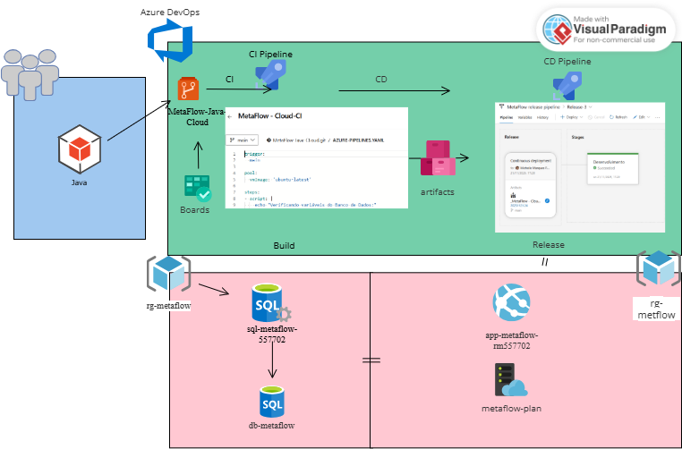

# MetaFlow - Sistema de Gestão de Metas
## 📋 Documentação do Projeto
#### Objetivo do Sistema:

API RESTful para gestão completa de metas pessoais e profissionais, desenvolvida em Spring Boot com deploy automatizado em nuvem Azure.

## 🏗️ Arquitetura e Infraestrutura
Diagrama de Arquitetura




### Stack Tecnológica
- Backend: Spring Boot 3.2.0 + Java 21

- Banco de Dados: Azure SQL Database

- Deploy: Azure App Service (Linux)

- CI/CD: Azure DevOps Pipelines

- Documentação: SpringDoc OpenAPI 3.0

- Recursos Azure Provisionados
Resource Group: rg-metaflow

- SQL Server: sql-metaflow-557702

- Database: db-metaflow

- App Service Plan: metaflow-plan (B1 - Linux)

- Web App: app-metaflow-rm557702

### 🔄 Fluxo DevOps Implementado
- Azure Boards - Gestão de Desenvolvimento
- Task inicial criada com ID #21 para rastreabilidade no commit inicial

Branch policies configuradas com:

- Revisor obrigatório para Pull Requests

- Vinculação de Work Item obrigatória

- Validação de resolução de comentários

- Histórico completo de commits vinculados à task

- Azure Repos - Controle de Versão
Repositório Git privado com histórico de desenvolvimento

- Estrutura de branches com main protegida

- Pull Requests com validações automatizadas

- Code review simulado conforme requisitos

- Azure Pipelines - Automação CI/CD
- Pipeline de Build (CI)
yaml
# azure-pipelines.yml - Configuração versionada
trigger:
- main  # Execução automática em commits

steps:
- Build com Gradle e Java 21
- Execução de testes JUnit
- Publicação de artefatos (JAR)
- Upload de resultados de testes

#### Funcionamento:

- Commit na branch main dispara build automático

- Compilação e execução de testes unitários

- Geração de artefato (JAR da aplicação)

- Publicação de resultados de testes no pipeline

- Pipeline de Release (CD)
Trigger: Automático após build bem-sucedido

- Deploy: Azure App Service (Linux)

- Configuração: Variáveis de ambiente protegidas


Etapas do Release:

- Download do artefato do build

- Configuração de app settings no Web App

- Deploy do arquivo JAR

- Execução com startup command específico

## 📜 Scripts de Infraestrutura
Script de Provisionamento - 

scripts/script-infra.sh

#### Objetivo do Script

Automatizar a criação completa de todos os recursos Azure necessários para executar a aplicação MetaFlow em ambiente de produção, seguindo a abordagem Infrastructure as Code.

#### Estrutura de Recursos Criados
O script implementa uma arquitetura PaaS completa com os seguintes componentes:

- Resource Group - Contêiner lógico para todos os recursos

- Azure SQL Database - Banco de dados relacional gerenciado

- App Service Plan - Plano de hospedagem para a aplicação

- Web App - Ambiente de execução da aplicação Spring Boot

- Configurações - Variáveis de ambiente e segurança

###### Detalhamento Técnico dos Comandos:

1. Criação do Resource Group
bash
az group create --name $RG --location $LOCATION
Propósito: Criar o grupo de recursos que irá agrupar todos os serviços relacionados

Nome: rg-metaflow - Segue padrão de nomenclatura Azure

Região: brazilsouth - Data center mais próximo para melhor latência

Funcionalidade: Organização lógica, gerenciamento de custos e permissions

2. Provisionamento do SQL Server
```bash
az sql server create \
    --name $SQL_SERVER \
    --resource-group $RG \
    --location $LOCATION \
    --admin-user $SQL_ADMIN \
    --admin-password "$SQL_PASSWORD"
```

Configurações do Servidor:

Nome: sql-metaflow-557702 - Identificador único global

Tier: Standard (default) - Balance entre custo e performance

Autenticação: SQL Authentication com credenciais segregadas

Segurança: Login administrativo com senha forte

3. Configuração de Regras de Firewall
```bash
az sql server firewall-rule create \
    --resource-group $RG \
    --server $SQL_SERVER \
    --name AllowAllDev \
    --start-ip-address 0.0.0.0 \
    --end-ip-address 255.255.255.255

```
Contexto de Desenvolvimento:

IP Range: 0.0.0.0 - 255.255.255.255 (acesso de qualquer origem)

Uso: Exclusivo para ambiente de desenvolvimento

Observação: Em produção, restringir para IPs específicos

Justificativa: Permite conexão do App Service e Azure DevOps

4. Criação do Banco de Dados
```bash
az sql db create \
    --resource-group $RG \
    --server $SQL_SERVER \
    --name $SQL_DB \
    --service-objective Basic \
    --backup-storage-redundancy Local
```
Especificações Técnicas:

Service Tier: Basic - Adequado para cargas de trabalho de desenvolvimento

DTU: 5 - Unidades de throughput de banco de dados

Storage: 2GB máximo - Suficiente para dados transacionais

Backup: Local redundancy - Cópias na mesma região

Compute: Shared resources - Econômico para desenvolvimento

5. Criação do App Service Plan
```bash
az appservice plan create \
    --name $PLAN_NAME \
    --resource-group $RG \
    --location $LOCATION \
    --sku B1 \
    --is-linux
```
Características do Plano:

SKU: B1 (Basic) - 1 core, 1.75GB RAM, 10GB storage

Sistema Operacional: Linux - Otimizado para Java/Spring Boot

Escala: Manual - Pode ser ajustado verticalmente conforme necessidade

Runtime: Suporte nativo a containers Linux

6. Criação da Web App
```bash
az webapp create \
    --resource-group $RG \
    --plan $PLAN_NAME \
    --name $WEBAPP_NAME \
    --runtime "JAVA:21-java21"
```
Configuração do Ambiente:

Runtime Stack: Java 21 - Versão LTS com suporte prolongado

Web Server: Tomcat embutido no Spring Boot

Deploy: Via arquivo JAR auto-contido

Logs: Configuração automática de Application Insights

7. Configuração de Variáveis de Ambiente
```bash
az webapp config appsettings set \
    --name $WEBAPP_NAME \
    --resource-group $RG \
    --settings \
        SPRING_DATASOURCE_URL="jdbc:sqlserver://$SQL_SERVER.database.windows.net:1433;database=$SQL_DB;encrypt=true;trustServerCertificate=false;hostNameInCertificate=*.database.windows.net;" \
        SPRING_DATASOURCE_USERNAME="$SQL_ADMIN" \
        SPRING_DATASOURCE_PASSWORD="$SQL_PASSWORD" \
        SPRING_JPA_HIBERNATE_DDL_AUTO="update" \
        SPRING_JPA_SHOW_SQL="true" \
        SPRINGDOC_API_DOCS_PATH="/v3/api-docs" \
        SPRINGDOC_SWAGGER_UI_PATH="/swagger-ui/index.html" \
        SERVER_PORT="80"

```
Configurações da Aplicação Spring Boot:

Conexão com Banco:

URL JDBC: String de conexão com SSL habilitado

Encryption: true - Conexões criptografadas obrigatórias

Trust Server Certificate: false - Validação de certificado

Login Timeout: 30 segundos - Timeout padrão

Configurações JPA/Hibernate:

ddl-auto: update - Cria/atualiza schema automaticamente

show-sql: true - Log de queries SQL (apenas desenvolvimento)

#### Documentação API:

SpringDoc: Configuração de paths para OpenAPI 3

Swagger UI: Interface web para teste de endpoints

Configurações de Rede:

Server Port: 80 - Porta HTTP padrão para acesso externo

Fluxo de Execução do Script
Verificação de Existência: Cada comando verifica se o recurso já existe

Criação Condicional: Cria apenas recursos não existentes

Configuração Sequencial: Segue dependências lógicas (ex: database após SQL server)

Validação Final: Confirmação de provisionamento completo

Considerações de Segurança
Credenciais: Armazenadas como variáveis, não hardcoded

Firewall: Configuração aberta apenas para desenvolvimento

SSL: Conexões de banco criptografadas por padrão

Access Control: Recursos isolados em resource group específico

Script de Banco de Dados - scripts/script-bd.sql
Estrutura de Tabelas
mf_usuarios: Cadastro de usuários do sistema

mf_metas: Metas e objetivos dos usuários

mf_checkins: Registros diários de progresso

mf_habilidades: Competências em desenvolvimento

 Características:

Chaves primárias com identity

Relacionamentos via foreign keys

Timestamps automáticos para criação

Constraints de integridade referencial

### 🔌 Configurações Técnicas
Variáveis de Ambiente
As seguintes variáveis são configuradas automaticamente no Web App:

properties
# Conexão com Banco de Dados
```bash
SPRING_DATASOURCE_URL=jdbc:sqlserver://sql-metaflow-557702.database.windows.net:1433;database=db-metaflow;encrypt=true;trustServerCertificate=false;hostNameInCertificate=*.database.windows.net;
SPRING_DATASOURCE_USERNAME=admin-metaflow
SPRING_DATASOURCE_PASSWORD=***
```

# Configurações JPA/Hibernate
SPRING_JPA_HIBERNATE_DDL_AUTO=update

SPRING_JPA_SHOW_SQL=true

# Documentação API
SPRINGDOC_API_DOCS_PATH=/v3/api-docs

SPRINGDOC_SWAGGER_UI_PATH=/swagger-ui/index.html

# Configurações da Aplicação
SERVER_PORT=80
SPRING_PROFILES_ACTIVE=prod
Segurança e Proteção
Credenciais de banco protegidas como secrets

Conexões criptografadas com SSL

Firewall configurado para acesso controlado

Variáveis sensíveis não versionadas no código

### 📊 Especificação da API

#### Estrutura de Endpoints

**Módulo de Usuários (/usuarios)**

| Método | Endpoint         | Descrição                    | Status        |
|--------|------------------|------------------------------|---------------|
| POST   | /usuarios        | Criação de novo usuário      | ✅ Implementado |
| GET    | /usuarios        | Listagem de todos os usuários| ✅ Implementado |
| GET    | /usuarios/{id}   | Busca de usuário por ID      | ✅ Implementado |
| PUT    | /usuarios/{id}   | Atualização de usuário       | ✅ Implementado |
| DELETE | /usuarios/{id}   | Exclusão de usuário          | ✅ Implementado |

**Módulo de Metas (/metas)**

| Método | Endpoint         | Descrição                    | Status        |
|--------|------------------|------------------------------|---------------|
| POST   | /metas           | Criação de nova meta         | ✅ Implementado |
| GET    | /metas           | Listagem de todas as metas   | ✅ Implementado |
| GET    | /metas/{id}      | Busca de meta por ID         | ✅ Implementado |
| PUT    | /metas/{id}      | Atualização de meta          | ✅ Implementado |
| DELETE | /metas/{id}      | Exclusão de meta             | ✅ Implementado |


## 📋 Exemplos de Payload - Operações CRUD
#### 👤 Usuários (/usuarios)
POST - Criar Usuário

```json
{
  "nome": "João Silva",
  "email": "joao.silva@email.com",
  "tituloProfissional": "Desenvolvedor Full Stack",
  "objetivoCarreira": "Tornar-me um arquiteto de software sênior em 3 anos"
}
```
PUT - Atualizar Usuário
```json
{
  "nome": "João Silva Santos",
  "email": "joao.santos@email.com",
  "tituloProfissional": "Desenvolvedor Sênior Full Stack",
  "objetivoCarreira": "Tornar-me Tech Lead em 2 anos"
}
```
GET - Resposta do Usuário
```json
{
  "id": 1,
  "nome": "João Silva",
  "email": "joao.silva@email.com",
  "tituloProfissional": "Desenvolvedor Full Stack",
  "objetivoCarreira": "Tornar-me um arquiteto de software sênior em 3 anos",
  "dataCriacao": "2024-01-15T10:30:00",
  "metasIds": [1, 2],
  "checkinsIds": [1, 2, 3],
  "habilidadesIds": [1, 2, 3]
}
```
### 🎯 Metas (/metas)
POST - Criar Meta
```json
{
  "usuarioId": 19,
  "titulo": "Aprender Spring Boot",
  "categoria": "HABILIDADES",
  "status": "ATIVA",
  "descricao": "Dominar o framework Spring Boot para desenvolvimento backend",
  "valorAtual": 2,
  "valorAlvo": 5,
  "prazo": "2025-12-30"
}
```
PUT - Atualizar Meta
```json
{
  "usuarioId": 19,
  "titulo": "Aprender Spring Boot Avançado",
  "categoria": "HABILIDADES",
  "status": "ATIVA",
  "descricao": "Dominar conceitos avançados do Spring Boot e Spring Security",
  "valorAtual": 3,
  "valorAlvo": 5,
  "prazo": "2025-12-30"
}
```
GET - Resposta da Meta
```json
{
  "id": 1,
  "titulo": "Aprender Spring Boot",
  "categoria": "HABILIDADES",
  "status": "ATIVA",
  "descricao": "Dominar o framework Spring Boot para desenvolvimento backend",
  "valorAtual": 2,
  "valorAlvo": 5,
  "prazo": "2024-06-30",
  "usuarioId": 1
}
```
💪 Habilidades (/habilidades)
POST - Criar Habilidade
```json
{
  "usuarioId": 19,
  "nome": "Java Spring Boot",
  "categoria": "Tecnologia",
  "nivelAtual": 2,
  "nivelDesejado": 5,
  "emAprendizado": true
}
```
PUT - Atualizar Habilidade
```json
{
  "usuarioId": 19,
  "nome": "Java Spring Boot",
  "categoria": "Backend Development",
  "nivelAtual": 3,
  "nivelDesejado": 5,
  "emAprendizado": true
}
```
GET - Resposta da Habilidade
```json
{
  "id": 1,
  "nome": "Java Spring Boot",
  "categoria": "Tecnologia",
  "nivelAtual": 2,
  "nivelDesejado": 5,
  "emAprendizado": true,
  "usuarioId": 1
}
```
### 📊 Check-ins (/checkins)
POST - Criar Check-in
```json
{
  "usuarioId": 19,
  "humor": 4,
  "qualidadeSono": 3,
  "nivelEstresse": 2,
  "produtividade": 4,
  "tempoTrabalho": 480,
  "tempoAprendizado": 120,
  "tempoLazer": 180,
  "anotacoes": "Dia produtivo, consegui finalizar o módulo de autenticação"
}
```
PUT - Atualizar Check-in
```json
{
  "usuarioId": 19,
  "humor": 5,
  "qualidadeSono": 4,
  "nivelEstresse": 1,
  "produtividade": 5,
  "tempoTrabalho": 420,
  "tempoAprendizado": 90,
  "tempoLazer": 210,
  "anotacoes": "Excelente dia! Finalizei o projeto e aprendi novos conceitos"
}
```
GET - Resposta do Check-in
```json
{
  "id": 1,
  "data": "2024-01-15",
  "humor": 4,
  "qualidadeSono": 3,
  "nivelEstresse": 2,
  "produtividade": 4,
  "tempoTrabalho": 480,
  "tempoAprendizado": 120,
  "tempoLazer": 180,
  "anotacoes": "Dia produtivo, consegui finalizar o módulo de autenticação",
  "usuarioId": 1
}
```
### 📈 Relatórios (/relatorios)
GET /relatorios/personalizado/{usuarioId}

##### Resposta:

```text
=== RELATÓRIO DE BEM-ESTAR - João Silva ===

 DADOS RECENTES:
- Humor médio: 4.2/5
- Nível médio de estresse: 2.1/5
- Qualidade média do sono: 3.8/5
- Metas ativas: 3
- Metas concluídas: 1
- Habilidades em aprendizado: 2

 ANÁLISE E RECOMENDAÇÕES:
- Seu humor está bom! Continue mantendo o equilíbrio.
- Seus níveis de estresse estão controlados. Ótimo trabalho!
- Sua qualidade de sono está boa. Continue com os bons hábitos!
- Parabéns! Você concluiu 1 meta(s). Continue assim!

 PRÓXIMOS PASSOS SUGERIDOS:
- Mantenha a consistência nos check-ins diários
- Revise suas metas ativas regularmente
- Equilibre tempo entre trabalho, aprendizado e lazer
- Celebre cada conquista, por menor que seja
```

#### GET /relatorios/recomendacoes/{usuarioId}
Resposta:

```text
=== RECOMENDAÇÕES DE CARREIRA - João Silva ===

Objetivo de carreira: Tornar-se um arquiteto de software sênior em 3 anos

 RECURSOS SUGERIDOS:
- Plataformas tech: Alura, RocketSeat, Udemy
- Cursos: Java Spring Boot, React, Cloud Computing

 PLATAFORMAS RECOMENDADAS:
- Coursera: Cursos de universidades internacionais
- LinkedIn Learning: Desenvolvimento profissional
- YouTube EDU: Conteúdo gratuito de qualidade

 COMPETÊNCIAS DO FUTURO:
- Inteligência Emocional
- Adaptabilidade
- Resolução de Problemas Complexos
- Comunicação Eficaz
- Pensamento Crítico
```
GET /relatorios/engajamento
Resposta:

```text
=== RELATÓRIO DE ENGAJAMENTO - METAFLOW ===

 DADOS GERAIS:
- Usuários registrados: 50
- Total de check-ins: 320
- Check-ins médios por usuário: 6.40
- Metas totais: 120 (45.8% concluídas)

 ANÁLISE:
-  Excelente engajamento! Usuários estão usando o app consistentemente.
-  Alta taxa de sucesso nas metas! Usuários estão alcançando objetivos.

 SUGESTÕES DE MELHORIA:
-  Notificações para check-ins diários
-  Gamificação com conquistas e recompensas
-  Relatórios visuais mais detalhados
-  Comunidade para compartilhar progresso
-  Metas em grupo para aumentar motivação
```
#### 📝 Observações Importantes:
Validações:
Humor, QualidadeSono, NivelEstresse, Produtividade: Valores de 1-5

NivelAtual, NivelDesejado: Valores de 0-5

Tempos: Em minutos (ex: 480 = 8 horas)

Anotações: Máximo 200 caracteres

Email: Formato válido obrigatório

Prazo: Data futura obrigatória

###### Enums Válidos:
Categoria (Metas): HABILIDADES, CARREIRA, SAUDE
Status (Metas): ATIVA, INATIVA, CONCLUIDA


#### 🌐 URLs de Acesso em Produção
##### Ambiente	URL	Propósito
###### Produção	https://app-metaflow-rm557702.azurewebsites.net	Aplicação principal
###### Documentação	https://app-metaflow-rm557702.azurewebsites.net/swagger-ui.html	Swagger UI
###### API Docs	https://app-metaflow-rm557702.azurewebsites.net/v3/api-docs	Especificação OpenAPI
###### Azure DevOps  https://dev.azure.com/rm555292LD/MetaFlow%20-%20Cloud 	Pipelines e Repositório

### 📁 Estrutura do Repositório
```text
MetaFlow-Java-Cloud/
├── 📄 azure-pipelines.yml          # Definição do pipeline CI/CD
├── 📁 scripts/
│   ├── 🔧 script-infra.sh          # Provisionamento Azure
│   └── 🗃️ script-bd.sql            # Estrutura do banco
├── 📁 src/
│   ├── 📁 main/java/               # Código fonte
│   │   ├── controller/             # Endpoints REST
│   │   ├── service/                # Lógica de negócio
│   │   ├── repository/             # Acesso a dados
│   │   ├── model/                  # Entidades JPA
│   │   ├── dto/                    # Objetos de transferência
│   │   ├── mapper/                 # Conversores
│   │   └── exception/              # Tratamento de erros
│   └── 📁 test/java/               # Testes automatizados
└── 📄 README.md                    # Esta documentação

```
### ✅ Validação de Requisitos Atendidos
- Provisionamento e Infraestrutura
Scripts Azure CLI para criação de recursos

- Resource Group, SQL Database, Web App

- Configuração automatizada de ambiente

- Azure DevOps
Projeto com Boards, Repos e Pipelines

- Pipeline de Build (CI) com testes JUnit

- Pipeline de Release (CD) automático

- Branch main protegida com políticas

- Vinculação entre commits e work items

- Implementação Técnica
Deploy via Web App PaaS (Linux)

- Banco Azure SQL Database

- Variáveis de ambiente protegidas

- Arquivo azure-pipelines.yml versionado

- Scripts de infraestrutura no repositório

- Documentação
Exemplos JSON completos de CRUD

- Especificação de endpoints REST

- Configurações técnicas detalhadas

- URLs de acesso em produção

### 🚀 Status de Implantação

| Componente            | Status | Detalhes                                                       |
|-----------------------|--------|-----------------------------------------------------------------|
| Infraestrutura Azure  | ✅ Ativo | Recursos provisionados e operacionais                           |
| Pipeline CI/CD        | ✅ Ativo | Build e deploy automatizados                                   |
| Aplicação Produção    | ✅ Ativo | Disponível em app-metaflow-rm557702.azurewebsites.net           |
| Banco de Dados        | ✅ Ativo | Azure SQL com conexão estabelecida                             |
| Monitoramento         | ✅ Ativo | Logs e métricas via Azure App Service                           |
